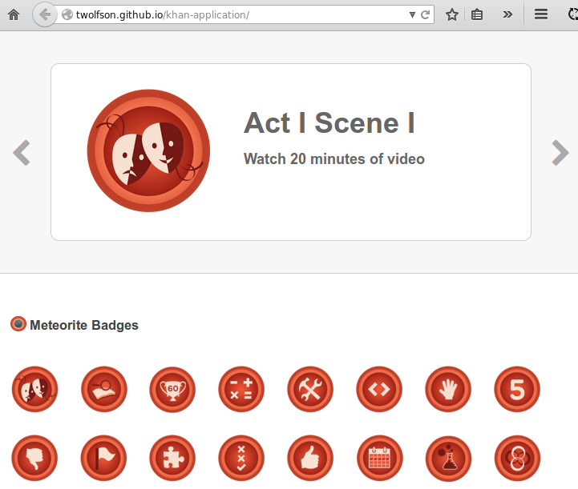

# khan-application
Application for Khan Academy

http://twolfson.github.io/khan-application/



## Getting started
To set up the project locally, run the following steps:

```bash
# Clone the repository
git clone https://github.com/twolfson/khan-application
cd khan-application

# Install development dependencies
npm install

# Build our HTML, CSS, and JS
npm run build
# Running "copy:public" (copy) task
# ...
# Done, without errors.

# Host the application locally
npm run serve
# serving /home/todd/github/khan-application/dist on por
```

A local development server should be running at [http://localhost:3000/][].

[http://localhost:3000/]: http://localhost:3000/

### Problems encountered
#### Anchors
Originally planned to use `anchors` for persisting location between pages. After playing with them, I realized I had to implement a different solution because clicking and the page jumping is not ideal.

### Architecture
#### Completed
- Badge explorer is standalone and can be unit tested
- Implemented reproducable build chain

#### Missing
- JS tests
- Visual regression tests
    - Open PhantomJS to a page, screenshot, click on a badge, screenshot, compare screenshots with expected results
    - http://twolfson.com/2014-02-25-visual-regression-testing-in-travis-ci

### Performance
#### Completed
- Delivered JSON with JS
    - No delay between page content and render waiting for external JS to download
- Minified HTML (automatically thanks to Jade)
- Stable sorted JSON data to make lookups for previous/next badges `O(1)`

#### Missing
- Minify JS
  - Use a grunt plugin that leverages `uglifyjs2`
- Minified CSS
  - Use a `grunt` plugin for consistency
- Move all *small* badges into a spritesheet
  - Do not use the large ones because they are displayed one at a time and would waste unnecessary bandwidth
- Optimized images
  - Use `grunt-imagemin`
- Separate spritesheets for sets of badges
    - Load the first 2 immediately, then lazy load remaining sets in background
- Use SVG over PNG for better scaling and smaller weight
- Move CDN URL's to `//` over `https://`
  - TODO: Take care of ^^
- Concatenate CDN JS/CSS with local CSS and host on another CDN
- Strip down JSON to what we need (e.g. delete most properties)
    - Smaller payload
    - Can be achieved now that we deliver the JSON with JS

### Design
#### Completed
- Implemented large display at top
- Added previous/next functionality
- Scroll to linked badge at start

#### Missing
- Responsive layout
    - TODO: Screenshot current example
- Highlight selected element
    - There will be issus with hexagonal badges unless we find another way to indicate focus

### TODOs
- Check inline TODOs
- If we take care of padding, then screenshot again

## Getting Started
Install the module with: `npm install khan-application`

```js
var khan_application = require('khan-application');
khan_application.awesome(); // "awesome"
```

## Documentation
_(Coming soon)_

## Contributing
In lieu of a formal styleguide, take care to maintain the existing coding style. Add unit tests for any new or changed functionality. Lint via [grunt](https://github.com/gruntjs/grunt).

## Unlicense
As of Nov 08 2014, Todd Wolfson has released this repository and its contents to the public domain.

It has been released under the [UNLICENSE][].

[UNLICENSE]: UNLICENSE
